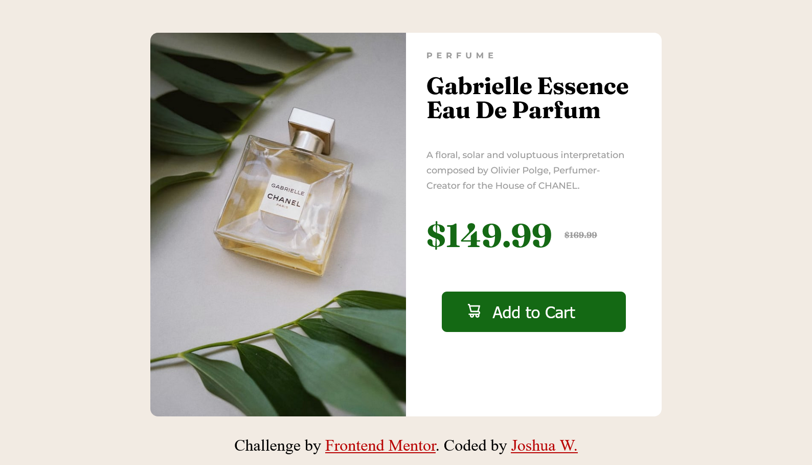
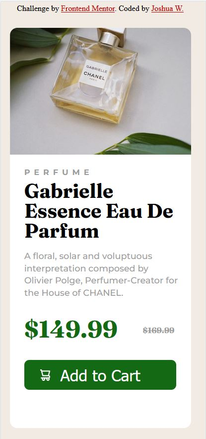

# Frontend Mentor - Product preview card component solution

This is a solution to the [Product preview card component challenge on Frontend Mentor](https://www.frontendmentor.io/challenges/product-preview-card-component-GO7UmttRfa). Frontend Mentor challenges help you improve your coding skills by building realistic projects. 

## Table of contents

- [Overview](#overview)
  - [The challenge](#the-challenge)
  - [Screenshot](#screenshot)
- [My process](#my-process)
  - [Built with](#built-with)
  - [What I learned](#what-i-learned)
  - [Continued development](#continued-development)
  - [Useful resources](#useful-resources)
- [Author](#author)
- [Acknowledgments](#acknowledgments)


## Overview
I created this Frontend Mentor challenge to help me improve my code. This challenge is focused on making a card component responsive to different screen layouts.

### The challenge

Users should be able to:

- View the optimal layout depending on their device's screen size
- See hover and focus states for interactive elements

### Screenshot

Below are two screenshots of my work with a desktop view and a mobile view




## My process

### Built with

- Semantic HTML5 markup
- CSS custom properties
- Flexbox
- Mobile-first workflow

### What I learned

Media queries where one of the major points I learnt during this project as I didn't know how it worked.
I needed to make sure that the card component was responsive. So I had to added a media query (code below) that would allow me to have a new set of code applied to the HTML markup on a smaller size screen.

Media query code snippet:

```css
  @media (max-width:1050px) {
```
I needed the image and the white box to be side by side on the desktop view and one on top of the other in the mobile view. I decided to use flexbox to allow the the whitebox and image to stay flexible on different screen views.

```css
desktop version
.container {
    display: flex;
    justify-content: center;
    }


This code snippet is within the media query for the mobile version. I needed flex-wrap in order to make the white box fall beneath the image.
.container {
        display: flex;
        flex-wrap: wrap;
        justify-content: center;
}

```

### Continued development

Points I would still like to learn or continue to develop are using media queries to create a more responsive.

Another point I would like to improve is to create cleaner code and have less code overall. I felt I had to deleted all of repeated and unnecessary code.

### Useful resources

- [MDN web docs](https://developer.mozilla.org/en-US/docs/Web/CSS/Media_Queries/Using_media_queries) - This helped me when I needed to added media queries. Straight forward and easy explanation for me.

## Author
Created by Joshua.
- Git - [Joshua W.](https://github.com/J-Wil21)
- Frontend Mentor - [@yourusername](https://www.frontendmentor.io/profile/J-Wil21)


## Acknowledgments

Something in a discord server mentioned frontend mentor and this is a prefect place to practice but coding skills. 
